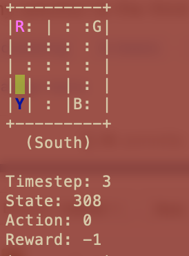
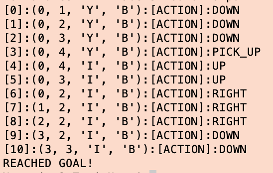
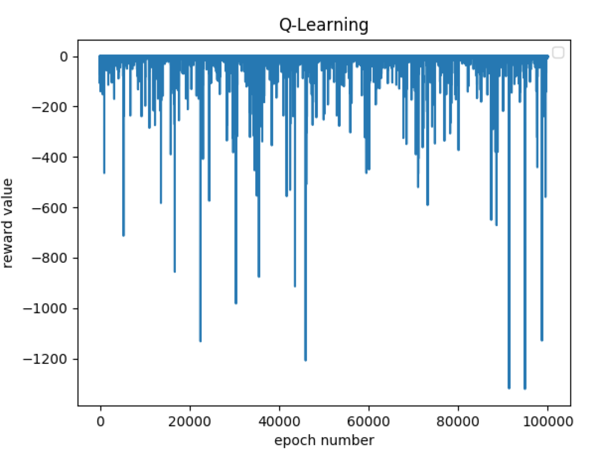

# Intelligent Taxi 

I solved the taxi-v2 problem (it's a really famouse one, you could just google it), using Q-Learning, Sarsa and using the OpenAI Gym enviroment.

## How do I run it?

you could use one of the following commands to run the corresponding code:

```
python main.py --qlearning 

or 

python main.py --sarsa

or 

python main.py --gym

```


The test is hard coded at the moment, but you could change it by changing the `testTheModel` function. 

The output of the OpenAI Gym version is a graphical one:



but Q-Learning and Sarsa output a text based result which includes, action number, state and choosen action. 



they also draw a plot showing the total reward in each step:



## Q-Learning and Sarsa 

The States are modeled as follows:

```
(POSITION[0], POSITION[1], PASSENGER, GOAL)
```

where POSITION is the taxi location in the map (row and column, top left is [0, 0]), and PASSENGER is one of the following characters ['R', 'G', 'Y', 'B', 'I'], where 'R', 'G', 'Y' & 'B' are points on the map and 'I' stands for Inside-the-taxi. GOAL is also of the following strings: ['R', 'G', 'Y', 'B']